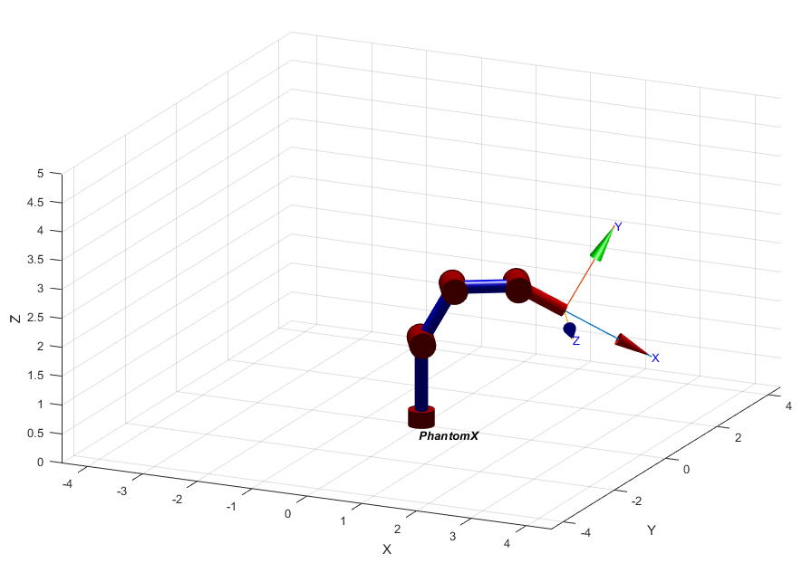

# Phantom X forward kinematics using ROS

This repository contains python scripts to interact with the Phantom X robot in order to change its position. This is done by changing the configuration space of each one of its joints through the communication with different services and topics in ROS. MATLAB is used to model an plot the robot using  Denavit–Hartenberg parameters.

## Measuring the Phantom X

We measure the length of the links of then PhantomX using a caliber. The measurements taken are:

* Link 1: 14.5 cm
* Link 2: 10.63 cm
* Link 3: 10.65 cm
* Link 4: 8.97 cm

Then,we assign a frame to each joint following the Denavit - Hartemberg convention. Please note that the pose shown in the following picture is the HOME position we established and it is not the same as the HOME position of Phantom X.


This results in the following DH parameters, in which *j* represents each joint.


## Phantom X in Matlab

First, we create a Serial Link using the Denavit - Hartemberg parameters. As we can see all joints are revolute.

```Matlab
%Dimensions
L1 = 145;
L2 = 106.3;
L3 = 106.3;
L4 = 89.7;

%DH parameters
a = [0;L2;L3;L4]/100; %Divided by 100 for better visualization
alpha = [90;0;0;0] * pi/180;
d = [L1;0;0;0]/100; %Divided by 100 for better visualization
theta = [0;0;0;0];
sigma = zeros(4,1); % sigma = 0 means the joint is revolute
offset = [0;90;-90;0]* pi/180;

%Serial Link Creation
DH_params = [theta d a alpha sigma offset];
Phantom = SerialLink(DH_params)
Phantom.name = "PhantomX";
```
### Plotting Phantom X

```Matlab
q1 = [0 0 0 0];
q2 = [-20 20 -20 20]*pi/180;
q3 = [30 -30 30 -30]*pi/180;
q4 = [-90 15 -55 17]*pi/180;
q5 = [-90 45 -55 45]*pi/180;

PlotRobot(Phantom,q5)

function PlotRobot(Robot,q)
figure()
Robot.plot(q,'nobase','notiles')
zlim([0 5])
end
```

In order to visualize the robot in different configurations, we declare the joint values for configuration `q1`,`q2`,`q3`,`q4` and `q5` and we pass these values to the `PlotRobot` function along with the SerialLink created previously.

The following pictures show the result for each configuration.





### Forward Kinematics. From base to tool

We calculate the homogeneous transformation matrix from the base to the TCP. We use the `Phantom.A` method, which returns the homogeneous transform that transforms from link frame {J-1} to frame {J}. We pass the arrays `[1 2 3 4]` and `[Q1 Q2 Q3 Q4]` so it calculates the homogeneous transform matrix from frame 0 to frame 4 directly using th symbolic joint values `[Q1 Q2 Q3 Q4]`. Lastly, we multiply the homogeneous transform matrix from frame 4 to the TCP using the `Phantom.tool` property.

```Matlab
syms Q1 Q2 Q3 Q4 Q5

%Calculate MTH
T_0T = Phantom.A([1 2 3 4],[Q1 Q2 Q3 Q4])*Phantom.tool;

%Simplify expression
T_0T = vpa(simplify(T_0T),10)
```
Here´s the result:


We can verify this result by comparing the result of evaluating the previous expression `T_0T` with `q3` joint values, and the result returned by the `fkine` method, which calculates the pose of the robot end-effector as an homogeneous transformation for a particular joint configuration.

```Matlab
T_0T_q3_1 = fkine(Phantom,q3)
T_0T_q3_2 = eval(subs(T_0T,[Q1 Q2 Q3 Q4],q3))
```

Here are the results:


## Moving the joints of Phantom X with ROS, Dynamixel Wizard and Python.

###  Identifying the joint values with Dynamixel Wizard

Each joint has a set of fields with certain values. We are interested in the *Goal position* field which allow us to move the robot's joints to the position we want. So first and foremost, we need to identify this field value for every joint for each configuration. We do this using Dynamixel Wizard which allow us to move the joint and observe the corresponding value. 

The results can be found in this [Excel Spreadsheet](https://docs.google.com/spreadsheets/d/1JklPGVPEIP4C9ZAH9POARIgHxPM0cXvG/edit?usp=sharing&ouid=103425137097383170225&rtpof=true&sd=true).

### Topic Publisher

We create a function that receives a pose and publish it to the */joint_trajectory* topic, which receives a joint trajectory to control DYNAMIXEL motors.

```python
def joint_publisher(input_pose):
    pub = rospy.Publisher('/joint_trajectory', JointTrajectory, queue_size=0)
    rospy.init_node('joint_publisher', anonymous=False)
    
    while not rospy.is_shutdown():
        state = JointTrajectory()
        state.header.stamp = rospy.Time.now()
        state.joint_names = ["joint_1", "joint_2", "joint_3", "joint_4", "joint_5"]
        point = JointTrajectoryPoint()
        point.positions =  input_pose   
        point.time_from_start = rospy.Duration(0.5)
        state.points.append(point)
        pub.publish(state)
        print('published command')
        rospy.sleep(1)
```

First, we create a *JointTrajectory* message with `JointTrajectory()`. We set the message time to the current time and we specify the joint names.
The message *JointTrajectory* contains an array of *JointTrajectoryPoint* messages, which define each point of the trajectory. Futhermore, a *JointTrajectoryPoint* message contains a *positions* property, which define each joint absolute value (from Phantom's HOME position) in radians for this point.
We create just one point with `JointTrajectoryPoint()`, we set its positions to the desired pose `input_pose`, and we set `time_from_start` (desired time from the trajectory start to arrive at this trajectory point) to 0.5 seconds. After adding this point to our trajectory, we publish the trajectory to the */joint_trajectory* topic.

### Topic Subscriber

We create a function that subscribes and listens to the *JointState* topic, which returns a message that holds data to describe the state of a set of torque controlled joints. 

```python
def listener():
    rospy.init_node('joint_listener', anonymous=True)
    rospy.Subscriber("/dynamixel_workbench/joint_states", JointState, callback)
    rospy.spin()
```

The `callback` function is used to print the data that was recorded. 

```python

HOME = [0,0,-87,0,-58.30]

def callback(data):
    result = "";
    for i in range(5):
        relativePosition = data.position[i] * (180/(pi)) - HOME[i]
        result += "Joint "+str((i+1))+":"+ "{:.2f}".format(relativePosition)
        if(i<4):
            result +=", "
    print(result)
```

Since `data.position` holds absolute joint values, we need to substract the absolute values of the HOME position we defined before so we get the relative joint values from our HOME position. 

### Service Caller

We need to call the *dynamixel_command* service. This service has a message that receives three parameters:

* *Addr.Name*: It can be *Goal_Position* if we want to change the value of the joint position or *Torque_Limit* if we want to change the torque limit of the joint
* *Id*: Each joint has a corresponing ID
* *Value*: The value that will be sent to the Addr.Name selected

We create a function that receives these parameters. It also receives the name of the command and a dwelling time before the service can be called again.Then, it calls the service.

```python
def jointCommand(command, id_num, addr_name, value, time):
    #rospy.init_node('joint_node', anonymous=False)
    rospy.wait_for_service('dynamixel_workbench/dynamixel_command')
    try:        
        dynamixel_command = rospy.ServiceProxy(
            '/dynamixel_workbench/dynamixel_command', DynamixelCommand)
        result = dynamixel_command(command,id_num,addr_name,value)
        rospy.sleep(time)
        return result.comm_result
    except rospy.ServiceException as exc:
        print(str(exc))
```

### Using Publisher and Subscriber

To use our publisher, we asked the user for the position they want to move. Then, we add our HOME absolute joint values to the relative joint values to get the absolute joint values of the desired position. Then we publish them with `joint_publisher`.

```python
HOME = [0,0,-87,0,-58.30] #Our HOME position in absolute coordinates
pose1 = [0,0,0,0,0]
pose2 = [-20,20,-20,20,0] 
pose3 = [-30,30,-30,30,0] 
pose4 = [-90,15,-55,17,0] 
pose5 = [-90,45,-55,45,10]

if __name__ == '__main__':
    try:
        inputvalue = int(input("Enter desired position (0 for HOME):"))
        posRad = positions[inputvalue]
        for i in range(len(posRad)):
            posRad[i] = (posRad[i]+ HOME[i]) * (pi/180) 
        joint_publisher(posRad)
    except rospy.ROSInterruptException:
        pass
```

We run our listener at the same time to verify the outcome. Here's a [video](https://youtu.be/tf3_tm8LR9E) of the result.

### Using Service and Subscriber

```python
if __name__ == '__main__':
    try:  
        jointCommand('', 1, 'Torque_Limit', 600, 0)
        jointCommand('', 2, 'Torque_Limit', 500, 0)
        jointCommand('', 3, 'Torque_Limit', 400, 0)
        jointCommand('', 4, 'Torque_Limit', 400, 0)
        while(True):
            inputvalue = int(input("Enter desired position (0 for HOME):"))
            print(inputvalue)
            if(inputvalue == 0):
                jointCommand('', 1, 'Goal_Position', 512, 0.5)
                jointCommand('', 2, 'Goal_Position', 512, 0.5)
                jointCommand('', 3, 'Goal_Position', 218, 0.5)
                jointCommand('', 4, 'Goal_Position', 512, 0.5)
                jointCommand('', 5, 'Goal_Position', 313, 0.5)
            elif(inputvalue == 1):
                jointCommand('', 1, 'Goal_Position', 444, 0.5)
                jointCommand('', 2, 'Goal_Position', 584, 0.5)
                jointCommand('', 3, 'Goal_Position', 150, 0.5)
                jointCommand('', 4, 'Goal_Position', 585, 0.5)
                jointCommand('', 5, 'Goal_Position', 313, 0.5)
            elif(inputvalue == 2):
                jointCommand('', 1, 'Goal_Position', 616, 0.5)
                jointCommand('', 2, 'Goal_Position', 415, 0.5)
                jointCommand('', 3, 'Goal_Position', 323, 0.5)
                jointCommand('', 4, 'Goal_Position', 412, 0.5)
                jointCommand('', 5, 'Goal_Position', 313, 0.5)
            elif(inputvalue == 3):
                jointCommand('', 1, 'Goal_Position', 205, 0.5)
                jointCommand('', 2, 'Goal_Position', 566, 0.5)
                jointCommand('', 3, 'Goal_Position', 30, 0.5)
                jointCommand('', 4, 'Goal_Position', 579, 0.5)
                jointCommand('', 5, 'Goal_Position', 313, 0.5)
            elif(inputvalue == 4):
                jointCommand('', 1, 'Goal_Position', 205, 0.5)
                jointCommand('', 2, 'Goal_Position', 668, 0.5)
                jointCommand('', 3, 'Goal_Position', 30, 0.5)
                jointCommand('', 4, 'Goal_Position', 668, 0.5)
                jointCommand('', 5, 'Goal_Position', 343, 0.5)
    except rospy.ROSInterruptException:
        pass
```
First, we use the service to limit the torque of the joints. This way, the robot won't move aggresively. As before, we asked the user for the position they want to move. Then, we use the service to set the goal position of each joint sequentially, going from the base to the gripper. Note that we used the values found on the **"Identifying the joint values with Dynamixel Wizard"** section.

We run our listener at the same time to verify the outcome. Here's a [video](https://youtu.be/P_-qOJ3rU0Y) of the result.

## Conclusions

The code developed in this exercise is simple yet very effective to control Phantom X robot. Therefore, it can be used to implement more complex behaviours suited for many applications. 

___

Developed by
[Juan David Díaz García](https://github.com/D4vidDG) and [Steven Gallego](https://github.com/jhairssteven).
