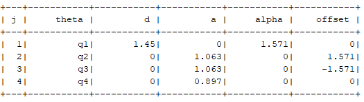
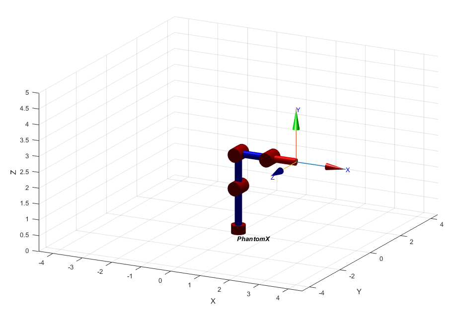
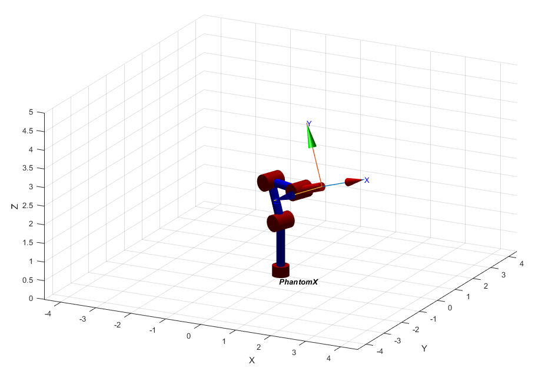
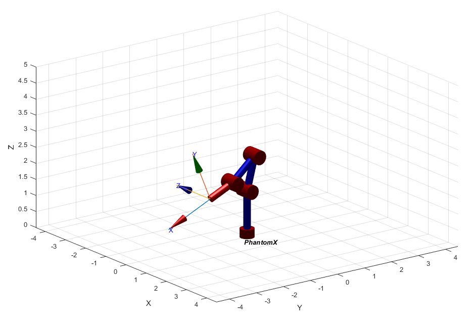

# Phantom X forward kinematics using ROS

This repository contains python scripts to interact with the Phantom X robot in order to change its position. This is done by changing the configuration space of each one of its joints through the communication with different services and topics in ROS. MATLAB is used to model an plot the robot using  Denavit–Hartenberg parameters.

## Measuring the Phantom X

We measure the length of the links of then PhantomX using a caliber. The measurements taken are:

* Link 1: 14.5 cm
* Link 2: 10.63 cm
* Link 3: 10.65 cm
* Link 4: 8.97 cm

Then,we assign a frame to each joint following the Denavit - Hartemberg convention. Please note that the pose shown in the following picture is the HOME position we established.


This results in the following DH parameters, in which _j_ represents each joint.



## Phantom X in Matlab

First, we create a Serial Link using the Denavit - Hartemberg parameters. As we can see all joints are revolute.

```Matlab
%Dimensions
L1 = 145;
L2 = 106.3;
L3 = 106.3;
L4 = 89.7;

%DH parameters
a = [0;L2;L3;L4]/100; %Divided by 100 for better visualization
alpha = [90;0;0;0] * pi/180;
d = [L1;0;0;0]/100; %Divided by 100 for better visualization
theta = [0;0;0;0];
sigma = zeros(4,1); % sigma = 0 means the joint is revolute
offset = [0;90;-90;0]* pi/180;

%Serial Link Creation
DH_params = [theta d a alpha sigma offset];
Phantom = SerialLink(DH_params)
Phantom.name = "PhantomX";
```
### Plotting Phantom X

```Matlab
q1 = [0 0 0 0];
q2 = [-20 20 -20 20]*pi/180;
q3 = [30 -30 30 -30]*pi/180;
q4 = [-90 15 -55 17]*pi/180;
q5 = [-90 45 -55 45]*pi/180;

PlotRobot(Phantom,q5)

function PlotRobot(Robot,q)
figure()
Robot.plot(q,'nobase','notiles')
zlim([0 5])
end
```

In order to visualize the robot in different configurations, we declare the joint values for configuration `q1`,`q2`,`q3`,`q4` and `q5` and we pass these values to the `PlotRobot` function along with the SerialLink created previously.

The following pictures show the result for each configuration.







### Forward Kinematics. From base to tool

We calculate the homogeneous transformation matrix from the base to the TCP. We use the `Phantom.A` method, which returns the homogeneous transform that transforms from link frame {J-1} to frame {J}. We pass the arrays `[1 2 3 4]` and `[Q1 Q2 Q3 Q4]` so it calculates the homogeneous transform matrix from frame 0 to frame 4 directly using th symbolic joint values `[Q1 Q2 Q3 Q4]`. Lastly, we multiply the homogeneous transform matrix from frame 4 to the TCP using the `Phantom.tool` property.

```Matlab
syms Q1 Q2 Q3 Q4 Q5

%Calculate MTH
T_0T = Phantom.A([1 2 3 4],[Q1 Q2 Q3 Q4])*Phantom.tool;

%Simplify expression
T_0T = vpa(simplify(T_0T),10)
```
Here´s the result:


We can verify this result by comparing the result of evaluating the previous expression `T_0T` with `q3` joint values, and the result returned by the `fkine` method, which calculates the pose of the robot end-effector as an homogeneous transformation for a particular joint configuration.

```Matlab
T_0T_q3_1 = fkine(Phantom,q3)
T_0T_q3_2 = eval(subs(T_0T,[Q1 Q2 Q3 Q4],q3))
```

Here are the results:


___

Developed by
[Juan David Díaz García](https://github.com/D4vidDG) and [Steven Gallego](https://github.com/jhairssteven).
