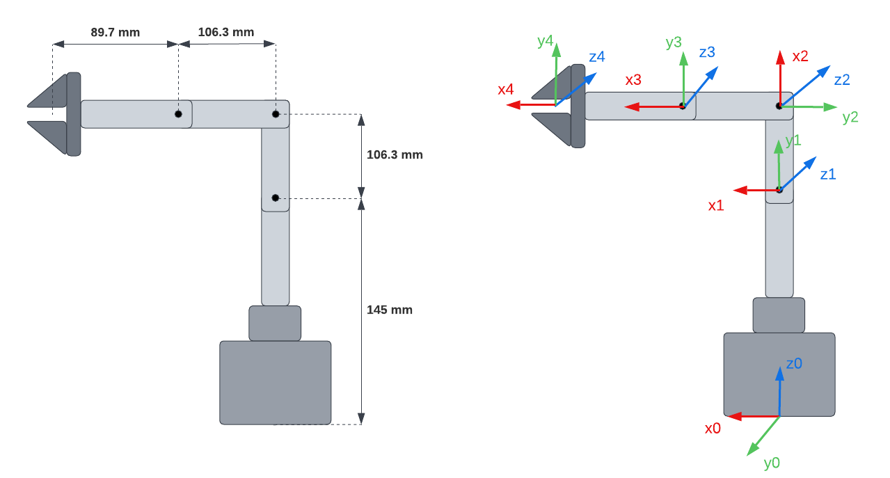
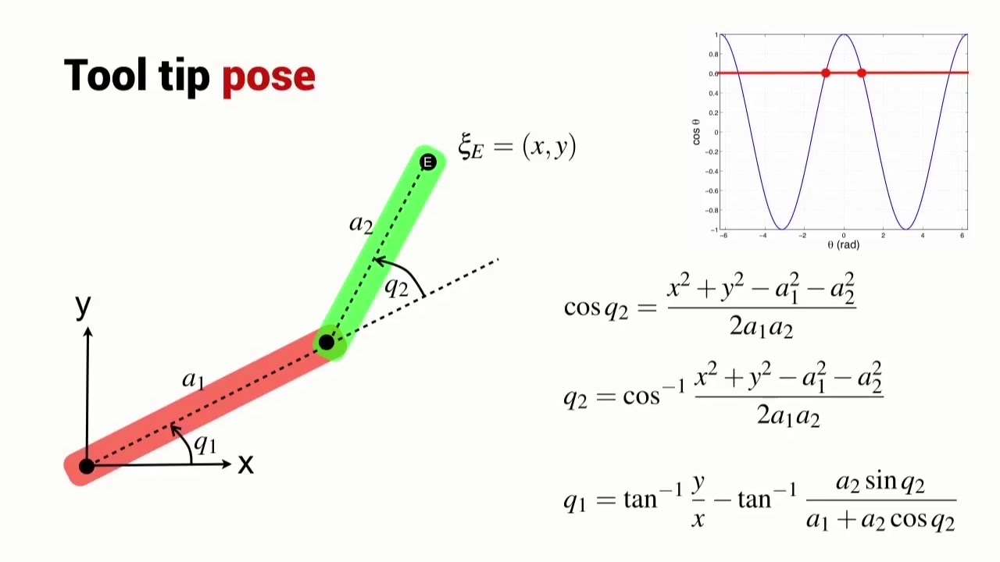
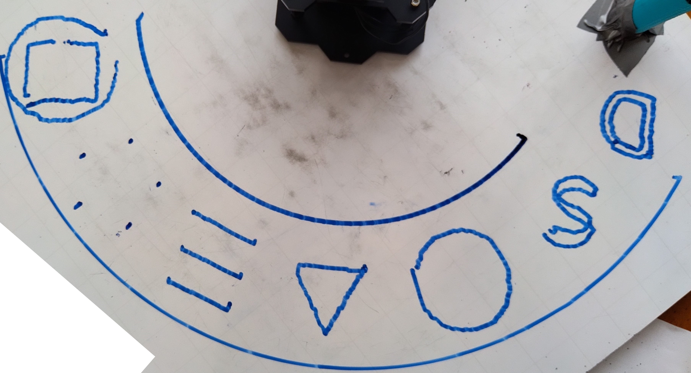
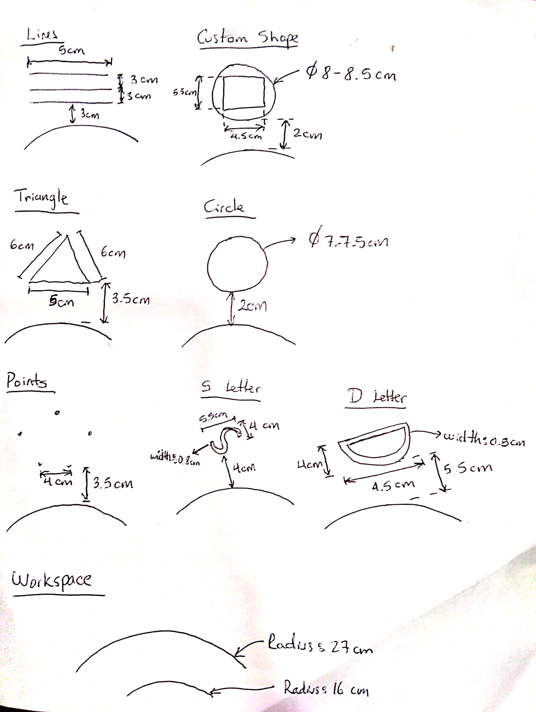
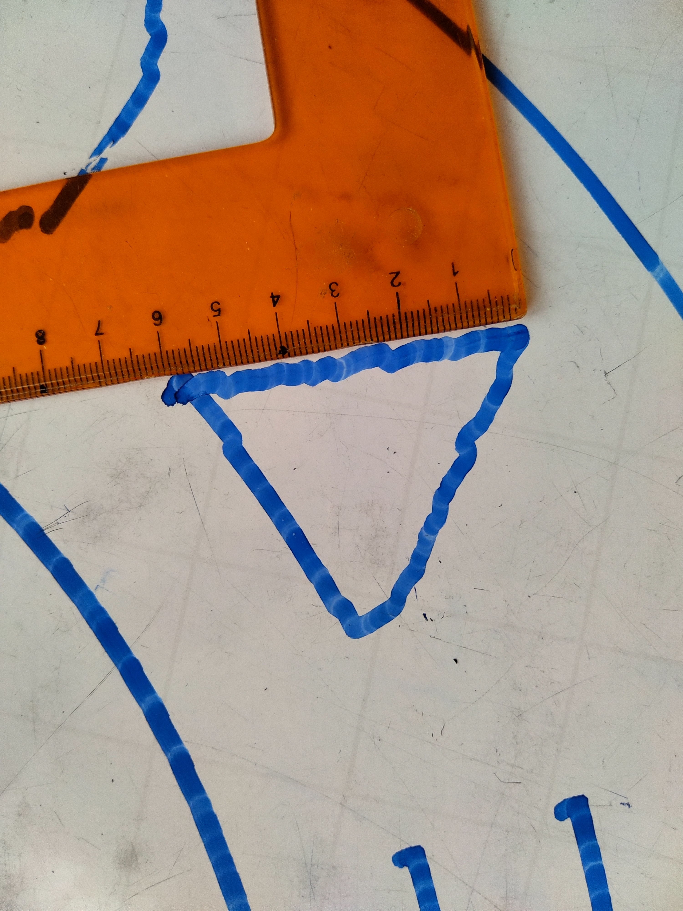
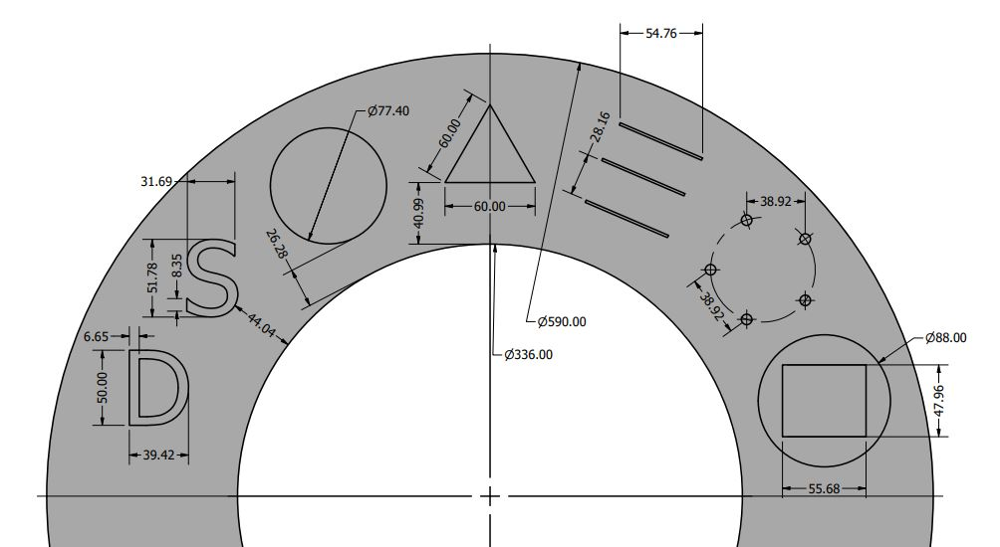
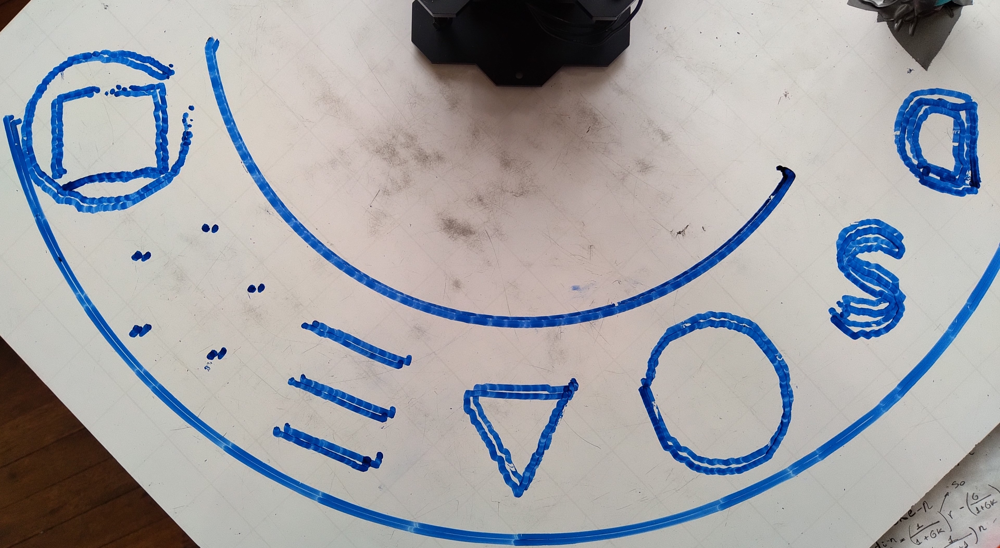
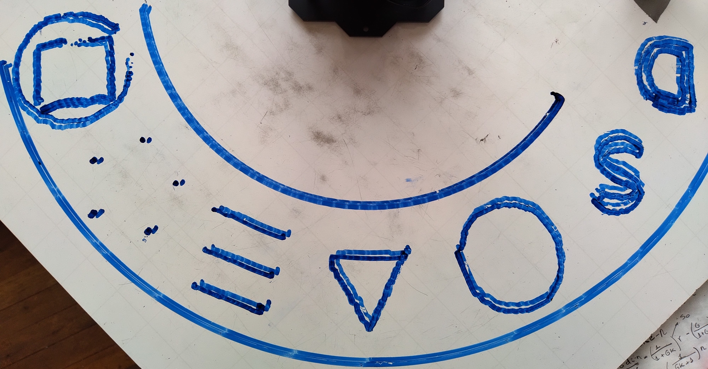
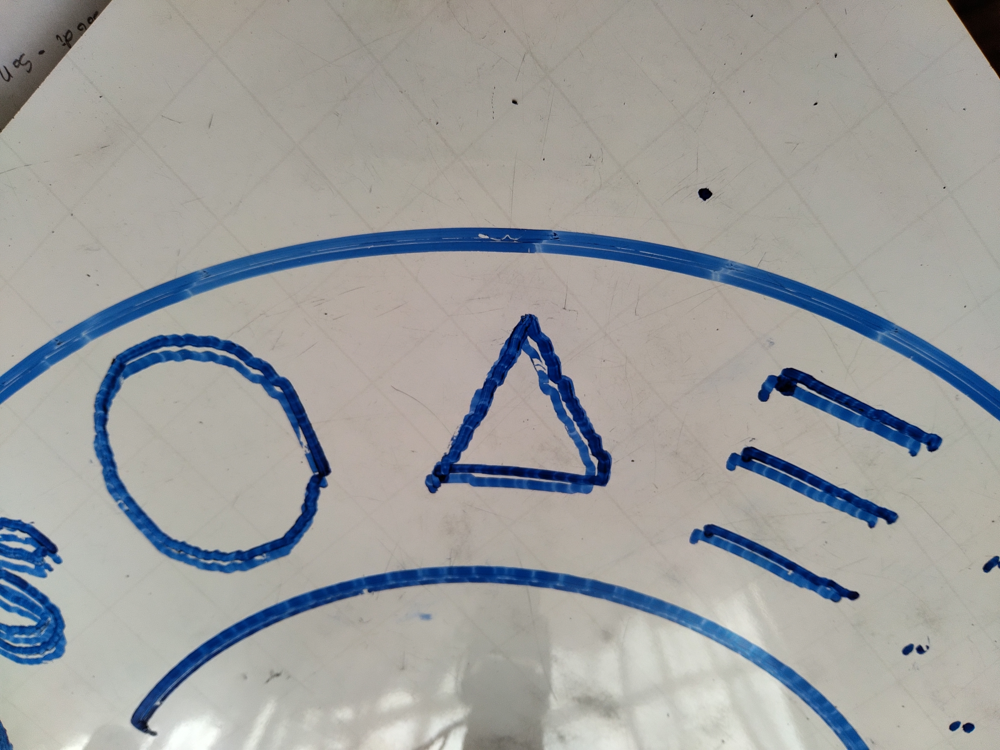
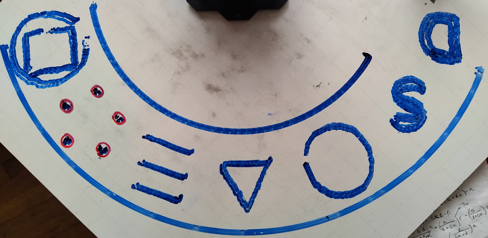

# Phantom X inverse kinematics using ROS

## Trajectory generation
___

Trajectories were generated using a base [CAD model](/lab5/CAD%20models/). Then, the autopath feature of RobotStudio was used in order to get the points' coordinates out from the generated targets in the RAPPID file.


On that file, the first list of three numbers represent the point coordinates of each target. A text editor was used to extract the relevant information and the final format can be seen in the generated [trajectory text files](/lab5/trajectories/). MS Excel was used to check the results in a graphical way, an example is shown  for the [custom shape](/lab5/trajectories/custom_part.txt) trajectory.


Below you can see the base CAD model with the generated targets in RobotStudio. The ring on which figures where build, represent the Phantom X workspace.


### Reading trajectories with Python
___

A Python script was used to parse the trajectories' text files and import all targets into a Python list to be used by other modules.
Code snipped is shown below.

```python
# Text file having the format
# Target:= [x,y,z],
def getTrajectoryFromTextFile(filename):
    with open(filename, 'r') as fobj:
        trajectory = []
        for line in fobj:
            coords_str = line.split()[-1][1:-2].split(",")
            coords = [float(n) for n in coords_str]
            trajectory.append(coords)

    return trajectory
```

### Point Format
___

Each point is defined as a vector with _x_, _y_ and _z_ coordinates. However, our robot will be constantly changing between 2 constant heights: a height for drawing and a height for moving around without drawing. Therefore, we defined the _z_ coordinate as follows:

- _z=1_ means height for moving around. 
- _z=0_ means height for drawing.
- _z=-1_ means height for drawing. In this case, the robot transitions from moving to drawing. This is used to smooth the movement when the robot is descending.

## Inverse kinematics
___

We need to determine which joint values result in the position we need.



The first angle is simple to calculate.


### Kinematic Decoupling
___

We will use kinematic decoupling to calculate the position of the robot's wrist, which is located in the fourth joint. This can be expressed as:

```python
wristPos = desiredPos -  L4*approach
```
Here, `approach` refers to the _X_ direction of tool's frame.

### Inverse kinematics for double pendulum
___

Note that the links from the second joint to the fourth joint form a double pendulum, which inverse kinematics are well known.



However, we need to obtain the wrist position measured from the second joint frame. Then, we calculate the transformation matrix from the first frame to the second.

$$wrist^1 = H_{0}^1 wrist^0$$

### Fourth joint
___

Given a tool orientation $\phi$ in relation to second joint's frame, the fourth joint value can be found as:

$$\theta_4 = \phi - \theta_3 - \theta_2$$

$\phi$ can be obtained from the approach vector measured from the second joint frame.


$$
approach^1 = H_{0}^1 approach^0 
\phi = atan(\frac{y_{app}}{x_{app}})
$$

### Python Implementation
___

We obtain both elbow-down and elbow-up solution.  

```python
def getJointValues(pose, degrees=True):
    try:
        q = np.double([[0, 0, 0, 0], [0, 0, 0, 0]])
        desiredPos = pose[0:4,3] 
        desiredOrientation = pose[0:3,0:3]
        approach = pose[0:4,0]

        #First joint value
        q[0,0] = math.atan2(desiredPos[1], desiredPos[0]) 
        q[1,0] = q[0,0] 

        #Mechanical Decoupling
        #Cálculo de la posición de la muñeca W
        wristPos = desiredPos -  L4*approach

        #Inverse kinematics for Double pendulum
        H10 = GetH10(q[0,0])
        wristPos_1 = H10*wristPos

        x = float(wristPos_1[0])
        y = float(wristPos_1[1])


        cos_theta3 = (x**2+y**2-L2**2-L3**2)/(2*L2*L3)
        sin_theta3 = np.real(sqrt(1-cos_theta3**2))
        theta3 = math.acos(cos_theta3)
        q[0,2] = -theta3 + (math.pi/2) #Elbow down
        q[1,2] = theta3 + (math.pi/2)  #Elbow up

        #Segunda articulación en radianes sin offset
        k1 = L2+L3*cos_theta3
        k2 = L3*math.sin(theta3)

        q[0,1] = math.atan2(y,x) + math.atan2(k2, k1) #Elbow down
        q[1,1] = math.atan2(y,x) - math.atan2(k2, k1) #Elbow up

        #Adding offset
        q[0,1] = q[0,1] - math.pi/2
        q[1,1] = q[1,1] - math.pi/2;   

        #Last joint
        approach_1 = H10[0:3,0:3]*approach[0:3,0]
        phi = math.atan2(approach_1[1],approach_1[0])
        q[0,3] = phi - q[0,1] -q[0,2]
        q[1,3] = phi - q[1,1] -q[1,2]
        
        if degrees:
            return np.degrees(q)
        return q
    except ValueError:
        print("Unreachable")
        return np.double([[-1, 0, 0, 0], [-1, 0, 0, 0]])
        
def GetH10(theta1):
    cos = math.cos(theta1)
    sin = math.sin(theta1)
    H10 = np.matrix([[cos,sin,0,0],
                        [0,0,1,-L1],
                        [sin,-cos,0,0] ,
                        [0,0,0,1]])
    return H10
```

Since we will need to maintain the drawing tool perpendicular to the surface, we created an extra function to obtain a matrix transformation that puts our tool perpendicular to the board.

```python
def getPerpendicularOrientation(coord):
    theta1 = math.atan2(coord[1],coord[0])
    cos_theta1 = np.real(cmath.cos(theta1))

    sin_theta1 = np.real(cmath.sin(theta1))
    H = np.matrix([[cos_theta1,0,sin_theta1 ,0],
                        [sin_theta1,0,-cos_theta1,0],
                        [0         ,1,0          ,0],
                        [0        ,0 ,0          ,1]]) #Perpendicular to surface
    return H
```

## Moving Phantom X
___

We defined a set of functions that allow us to move the robot's joints synchronously and also open and close the gripper. 

### Motor configuration
___

We enable torque in each joint and we limit it to a fixed value.

```python
def configMotors():
    for i in range(1, 4):
        jointCommand("", i, "Torque_Limit", 900, 0)
        jointCommand("", i, "Torque_Enable", 1, 0)
```

### Executing trajectories
___

We use the _'/joint_trajectory'_ topic to publish a set of points the robot should follow.

```python
#Publisher
pub = rospy.Publisher('/joint_trajectory', JointTrajectory, queue_size=0)
rospy.init_node('joint_publisher', anonymous=False)
#Trajectory parameters
state = None
durationCount = 0
waitCount = 0
trajectory_point_duration = 0.15
wait_Per_Point = 0.8

def initializeTrajectory():
    global state
    state = JointTrajectory()
    state.header.stamp = rospy.Time.now()
    state.joint_names = ["joint_1", "joint_2", "joint_3", "joint_4", "joint_5"]
    global durationCount, waitCount
    durationCount = 0
    waitCount = 0

def addPointToTrajectory(angles, durationScale):
    global durationCount, waitCount
    durationCount = durationCount + trajectory_point_duration*durationScale
    point = JointTrajectoryPoint()
    point.positions =  np.multiply(angles,pi/180) 
    point.time_from_start = rospy.Duration(durationCount)
    state.points.append(point)
    waitCount = waitCount + wait_Per_Point*durationScale

def executeTrajectory():
    pub.publish(state)
    time.sleep(waitCount)
```

```initializeTrajectory()``` creates the trajectory and initializes two counters: ```durationCount``` and ```waitCount```.
```durationCount``` is used to establish ```time_from_start``` for each point, which is the time from the start of the trajectory when the robot ***should*** arrive to that point. Each trajectory point's ```time_from_start``` must be greater than the last.```waitCount``` is used to calculate the time we'll wait for the trajectory to execute completely before returning control to the main thread.

```addPointToTrajectory``` adds a point to the trajectory. Each point contains joint values calculated for a specific position. Counters are updated taking into account a ```durationScale```, which is used to change the waiting time a specific point should take. For example, when _z=-1_, the robot is descending and the movement should be slower. Therefore, we use ```durationScale``` to increase the duration of that movement.

Finally, ```executeTrajectory()``` publishes the trajectory and waits until it is completed.

### Moving joints using service

Notice that all joint values are set in the previous step, including the gripper's opening. However, we defined extra functions to manipulate the gripper independently.

```python
def jointCommand(command, motor_id, addr_name, value, time):
    rospy.wait_for_service("dynamixel_workbench/dynamixel_command")
    try:
        dynamixel_command = rospy.ServiceProxy(
            "/dynamixel_workbench/dynamixel_command", DynamixelCommand
        )
        result = dynamixel_command(command, motor_id, addr_name, value)
        rospy.sleep(time)
        return result.comm_result
    except rospy.ServiceException as exc:
        print(str(exc))

def setGripperPosition(servoValue: int = 0) -> None:
    """
    Set the gripper position to the specified 0 to 1023 value
    """
    jointCommand("", 5, "Goal_Position", servoValue, 0)
```
In this case, we use _dynamixel_command_ service to change the gripper's opening. Another function was created to move joints using this service.

```python
def setPhantomPose(q, waitTime):
    """Doesn't set gripper"""
    q = degrees2digital(q)
    for i in range(0, 4):
        jointCommand("", i+1, "Goal_Position", q[i],waitTime)
```


## Main program
___

First, we configure the motors. Then, we print the menu and wait for the user's input. When an option is selected, we process that input with ```parse_option```.

```python
def main():
    configMotors()
    tool_loaded = False
    print_menu()
    while True:
        try:
            option = int(input("Next action: "))
            if option not in range(1,11):
                raise ValueError
        except ValueError:
            os.system('clear')
            print_menu()
        else:
            tool_loaded = parse_option(option, tool_loaded)
```

### Drawing
___

```python
def draw(filename):

    trajectory_filename = os.path.join(os.path.dirname(os.path.dirname(os.path.abspath(__file__))),"trajectories",filename)
    trajectory = getTrajectoryFromTextFile(trajectory_filename)

    initializeTrajectory()

    for coord in trajectory:

        pose = getPerpendicularOrientation(coord)

        pose[0,3] = coord[0]
        pose[1,3] = coord[1]

        durationScale = 1

        if(coord[2] == 1):
            pose[2,3] = moving_distance_From_Plane
            durationScale = 2
        else:
            radius = np.real(cmath.sqrt(coord[0]**2 + coord[1]**2))
            heightCorrection = mapValue(radius,219,250,-8,0)
            pose[2,3] = drawing_distance_From_Plane + heightCorrection
            if(coord[2] == -1):
                durationScale = 2
            else:
                durationScale = 1

        q = getJointValues(pose, degrees=True)

        print_state(filename, [int(n) for n in coord])

        if(q[0,0] != -1):
            elbow_up_joints = q[0] + HOME + CORRECTIONS
            elbow_up_joints = np.append(elbow_up_joints,closed_Gripper_Angle_Value)
            addPointToTrajectory(elbow_up_joints,durationScale)
            

    executeTrajectory()

def print_state(filename, coord):
    print("Routine: {}. End effector: X: {} Y: {} Z: {} (mm)"
            .format(filename, coord[0], coord[1], coord[2]))
```

First, we retrieve the coordinates of the trajectory from the text file. Then, for each coordinate, we construct the matrix transformation using the desired position and a perpendicular orientation. 

The _z_ coordinate is set based on the convention we explained before. Additionally, we noticed the tool rised above the desired height when it was near the robot's base. Therefore, we add a ```heightCorrection``` depending on the ```radius``` of the coordinate.

After that, we obtain the joint values for that coordinate applying inverse kinematics. We add the ```HOME``` position to the joint values and also some ```CORRECTIONS```.  There were two corrections: (1) coordinates had a 90 degrees offset from the actual position, so we removed that offset in the first joint; and (2) the fourth joint was not totally perpendicular to the surface because gravity pulled the joint down a bit, so we compensated that effect.

We add all points to the trajectory and we execute it.

### Loading and unloading tool
___

This functionality was implemented following almost same steps explained before.

### Go to Home Routine
___

This routines uses the ROS service.

```python
def goToHome():
    q = [0,0,-90,0]
    setPhantomPose(q,0.5)
```

##  Results
___

Here's a [video](https://youtu.be/R8t0FMSQWJM) of the final result.

Here's an image of the final result.



### Dimensional verification
___

This verification was done measuring the figures drawn by the robot in real life and comparing then to the ones craeted in CAD.

#### Real dimensions



#### CAD dimensions


This verification was done measuring the figures drawn by the robot in real life and comparing then to the ones craeted in CAD.



#### Real dimensions


#### CAD dimensions


### Repeatability
___

We can observe the robot's repeteability by performing the same trajectory multiple times. Four tests were performed.

#### First vs Second test

Comparing the first and the second test, we observe that the robot drew the same trajectory with a little offset. This offset was measured as 50 milimeters.



#### Second vs Third test

Comparing the second and the third test, we observe that the robot did the same trajectory in both cases because the second line appears darker. However, there was an offset of 10 or 20 milimeters when the custom shape and the workspace were drawn.




#### Third vs Fourth test

Comparing the third and last test, we observe that the robot did something in between the first and the second trajectory.



#### Observing the dots

If we look at the dots drawn by the robot after all tests, we get a better picture of repeatability. The radius of these circles is around 1 centimeter.


#### Conclusion

We conclude that robot's repeatability alse depended on how the tool was gripped. Taking this into account, we can estimate robot's repeatability between 50 and 100 milimeters.

### Error calculation

We put the CAD drawing over the real drawing to observe the error.


## Conclusions


